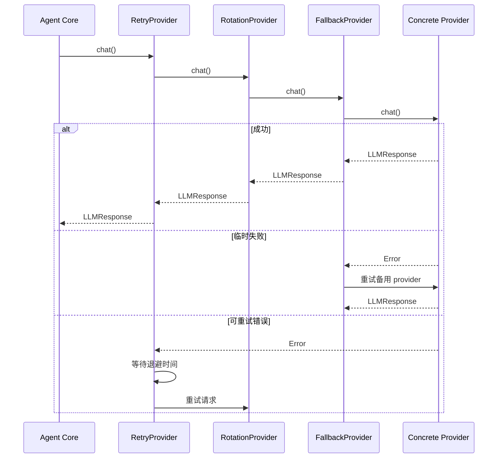

# Provider Core 模块文档

## 1. 模块概述

Provider Core 模块是 ZeptoClaw 系统的核心组件，负责管理与各种大语言模型（LLM）提供商的交互。该模块提供了一个统一的抽象层，支持多种 LLM 提供商（如 OpenAI、Anthropic、Groq 等），并实现了智能的错误处理、重试、回退和负载均衡机制。

### 主要功能

- **统一的 Provider 接口**：定义了标准的 `LLMProvider` trait，支持 chat、chat_stream 和 embed 操作
- **多种弹性机制**：提供重试（Retry）、回退（Fallback）和旋转（Rotation）等容错策略
- **健康状态管理**：实时跟踪各个 provider 的健康状态，自动跳过不健康的 provider
- **冷却机制**：基于错误类型实施智能冷却策略，避免频繁重试失效的 provider
- **Provider 注册与解析**：中心化的 provider 注册表，支持动态选择和配置

### 设计理念

Provider Core 模块采用装饰器模式和组合模式设计，通过层层包装基础 provider 来添加额外的功能（如重试、回退等）。这种设计使得各个功能可以独立演进，同时保持良好的组合性。

## 2. 架构概览

Provider Core 模块的架构可以分为以下几个层次：

```mermaid
graph TB
    subgraph "应用层"
        Agent[Agent Core]
    end
    
    subgraph "装饰器层"
        Retry[RetryProvider]
        Fallback[FallbackProvider]
        Rotation[RotationProvider]
    end
    
    subgraph "核心层"
        LLMProvider[LLMProvider Trait]
        Types[Types<br/>(ToolDefinition, LLMResponse等)]
        Registry[Provider Registry]
    end
    
    subgraph "实现层"
        OpenAI[OpenAI Provider]
        Claude[Claude Provider]
        Gemini[Gemini Provider]
        Other[其他 Provider...]
    end
    
    Agent --> Retry
    Agent --> Fallback
    Agent --> Rotation
    Retry --> LLMProvider
    Fallback --> LLMProvider
    Rotation --> LLMProvider
    LLMProvider --> Types
    LLMProvider --> Registry
    LLMProvider --> OpenAI
    LLMProvider --> Claude
    LLMProvider --> Gemini
    LLMProvider --> Other
```

### 核心组件说明

1. **LLMProvider Trait**：定义了所有 provider 必须实现的核心接口
2. **类型定义**：包括 `ToolDefinition`、`LLMResponse`、`Usage` 等核心数据结构
3. **Provider Registry**：维护可用 provider 的元数据和配置解析逻辑
4. **装饰器 Providers**：
   - `RetryProvider`：为请求添加自动重试功能
   - `FallbackProvider`：在主 provider 失败时切换到备用 provider
   - `RotationProvider`：在多个 provider 之间进行负载均衡
5. **支撑组件**：
   - `CooldownTracker`：跟踪 provider 的冷却状态
   - `CircuitBreaker`：实现熔断器模式
   - `ProviderHealth`：管理单个 provider 的健康状态

## 3. 子模块功能

Provider Core 模块包含以下几个主要子模块，每个子模块都有详细的文档：

### 3.1 类型系统（types）

类型子模块定义了 Provider Core 模块的核心数据结构和 trait。它包括：

- `LLMProvider` trait：所有 provider 必须实现的接口
- `ToolDefinition`：描述可被 LLM 调用的工具
- `LLMResponse`：LLM 的响应结构
- `ChatOptions`：聊天请求的配置选项
- `Usage`：token 使用统计
- `StreamEvent`：流式响应的事件类型

详细信息请参考 [provider_types.md](provider_types.md)。

### 3.2 Provider 注册表（registry）

注册表子模块负责管理 provider 的元数据和配置解析。它提供了：

- `ProviderSpec`：provider 的元数据描述
- `RuntimeProviderSelection`：运行时的 provider 选择结果
- provider 解析函数：根据配置选择合适的 provider

详细信息请参考 [provider_registry.md](provider_registry.md)。

### 3.3 冷却追踪（cooldown）

冷却追踪子模块实现了基于错误类型的智能冷却机制。它包括：

- `FailoverReason`：错误类型分类
- `CooldownTracker`：线程安全的冷却状态管理器
- 指数退避策略：根据错误类型和连续失败次数调整冷却时间

详细信息请参考 [provider_cooldown.md](provider_cooldown.md)。

### 3.4 回退机制（fallback）

回退子模块提供了主备 provider 的自动切换功能。它包括：

- `FallbackProvider`：主备 provider 切换器
- `CircuitBreaker`：熔断器实现，避免频繁重试失效的主 provider
- 与冷却机制的集成：智能判断何时跳过主 provider

详细信息请参考 [provider_fallback.md](provider_fallback.md)。

### 3.5 重试机制（retry）

重试子模块为请求添加了自动重试功能。它包括：

- `RetryProvider`：自动重试装饰器
- 可重试错误判断：区分临时错误和永久错误
- 指数退避与抖动：避免重试风暴
- 重试预算：限制总重试时间

详细信息请参考 [provider_retry.md](provider_retry.md)。

### 3.6 旋转机制（rotation）

旋转子模块实现了多 provider 的负载均衡。它包括：

- `RotationProvider`：多 provider 旋转器
- 多种旋转策略：Priority、RoundRobin 和 CostAware
- 健康状态跟踪：实时监控每个 provider 的健康状态
- 成本感知选择：根据模型定价选择最便宜的可用 provider

详细信息请参考 [provider_rotation.md](provider_rotation.md)。

## 4. 核心工作流程

### 4.1 典型请求流程

一个典型的 LLM 请求流程如下：



### 4.2 Provider 选择流程

当使用 `RotationProvider` 时，provider 选择流程如下：

1. 根据旋转策略确定候选 provider 顺序
2. 检查每个候选 provider 的健康状态
3. 选择第一个健康的 provider
4. 如果所有 provider 都不健康，选择失败时间最早的 provider（最可能已恢复）

## 5. 使用示例

### 5.1 基本使用

```rust
use zeptoclaw::providers::{LLMProvider, ChatOptions, ToolDefinition};
use zeptoclaw::providers::openai::OpenAIProvider;

// 创建一个基础 provider
let provider = OpenAIProvider::new("api-key");

// 发送聊天请求
let response = provider.chat(
    vec![],  // messages
    vec![],  // tools
    None,    // model override
    ChatOptions::default()
).await?;

println!("Response: {}", response.content);
```

### 5.2 使用重试装饰器

```rust
use zeptoclaw::providers::retry::RetryProvider;

let inner = OpenAIProvider::new("api-key");
let provider = RetryProvider::new(Box::new(inner))
    .with_max_retries(5)
    .with_base_delay_ms(500);

// 使用 provider 发送请求，失败时会自动重试
```

### 5.3 使用回退机制

```rust
use zeptoclaw::providers::fallback::FallbackProvider;
use zeptoclaw::providers::claude::ClaudeProvider;

let primary = Box::new(ClaudeProvider::new("claude-key"));
let fallback = Box::new(OpenAIProvider::new("openai-key"));
let provider = FallbackProvider::new(primary, fallback);

// 如果 Claude 失败，会自动重试 OpenAI
```

### 5.4 使用多 provider 旋转

```rust
use zeptoclaw::providers::rotation::{RotationProvider, RotationStrategy};

let providers: Vec<Box<dyn LLMProvider>> = vec![
    Box::new(ClaudeProvider::new("claude-key")),
    Box::new(OpenAIProvider::new("openai-key")),
    Box::new(OpenAIProvider::with_base("groq-key", "https://api.groq.com/openai/v1")),
];

let provider = RotationProvider::new(
    providers,
    RotationStrategy::CostAware,  // 选择成本最低的健康 provider
    3,  // 失败阈值
    30  // 冷却时间（秒）
);
```

## 6. 配置说明

Provider Core 模块的配置主要通过以下几个配置类型完成（在 `configuration` 模块中定义）：

- `ProvidersConfig`：全局 provider 配置
- `ProviderConfig`：单个 provider 的配置
- `RetryConfig`：重试策略配置
- `FallbackConfig`：回退策略配置
- `RotationConfig`：旋转策略配置

详细的配置说明请参考 [configuration.md](configuration.md)。

## 7. 与其他模块的关系

Provider Core 模块是 ZeptoClaw 系统的核心服务之一，与其他模块的关系如下：

- **Agent Core**：使用 Provider Core 来执行 LLM 请求
- **Provider Implementations**：包含具体的 provider 实现（如 OpenAI、Claude 等）
- **Configuration**：提供 Provider Core 的配置类型和验证
- **Service Resilience and Ops**：使用 Provider Core 的健康状态和使用 metrics

## 8. 扩展指南

### 8.1 添加新的 Provider

要添加新的 provider，需要：

1. 实现 `LLMProvider` trait
2. 在 `PROVIDER_REGISTRY` 中添加对应的 `ProviderSpec`
3. 在 `provider_config_by_name` 函数中添加配置解析逻辑
4. （可选）添加特定的请求/响应类型

### 8.2 添加新的装饰器

要添加新的 provider 装饰器（如自定义的重试逻辑），需要：

1. 创建一个新的结构体，包含一个 `Box<dyn LLMProvider>` 字段
2. 实现 `LLMProvider` trait，在方法中添加自定义逻辑
3. 委托实际的请求到内部的 provider

## 9. 注意事项和限制

1. **装饰器顺序**：装饰器的顺序很重要。通常建议的顺序是：`RetryProvider` 在外层，然后是 `FallbackProvider` 或 `RotationProvider`。
2. **冷却时间**：不同的错误类型有不同的冷却时间，计费错误的冷却时间最长（可达 24 小时）。
3. **不可重试错误**：认证错误、计费错误和无效请求错误不会触发重试或回退。
4. **Embed 方法**：大多数装饰器不会对 `embed` 方法应用额外的逻辑，而是直接委托给内部 provider。
