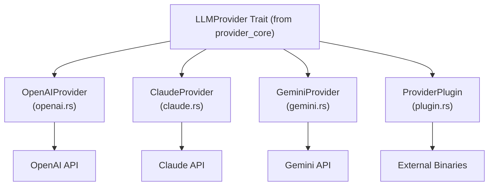

# Provider Implementations Module

## Overview

The `provider_implementations` module provides concrete implementations of the `LLMProvider` trait for various Large Language Model (LLM) APIs. This module is part of the larger ZeptoClaw framework and enables seamless integration with popular LLM services including OpenAI, Claude (Anthropic), Gemini (Google), and custom provider plugins.

### Purpose and Design Rationale

This module is designed to:
- Provide a unified interface to different LLM APIs through the `LLMProvider` trait
- Handle API-specific message formats, authentication, and error handling
- Support both synchronous chat completions and streaming responses
- Enable tool/function calling capabilities across different providers
- Allow for easy extension through a plugin system

The design follows an adapter pattern where each provider implementation translates between the framework's common data types and the API-specific formats required by each LLM service.

## Architecture

The module consists of four main provider implementations, each in their own file:



Each provider implementation handles:
1. **Authentication**: API keys, OAuth tokens, or other auth mechanisms
2. **Request Conversion**: Translating framework messages to API-specific formats
3. **Response Parsing**: Converting API responses back to framework types
4. **Error Handling**: Provider-specific error translation and recovery
5. **Streaming**: Server-Sent Events (SSE) streaming for real-time responses

### Core Components

#### 1. OpenAI Provider (`openai.rs`)
- **Purpose**: Integrate with OpenAI's Chat Completions API and compatible APIs
- **Key Features**:
  - Supports both `max_tokens` and `max_completion_tokens` for different model families
  - Automatic model detection for token parameter handling
  - Compatible with OpenAI-compatible endpoints (Azure, local models, Groq, etc.)
  - Streaming support with incremental content and tool calls
  - Embedding API support
- **Default Model**: `gpt-5.1` (configurable at compile time)

#### 2. Claude Provider (`claude.rs`)
- **Purpose**: Integrate with Anthropic's Claude API
- **Key Features**:
  - Separates system prompt from conversation messages (Claude-specific)
  - Uses content blocks for tool calls and results
  - Supports both API key and OAuth Bearer token authentication
  - Full streaming support with SSE event parsing
- **Default Model**: `claude-sonnet-4-5-20250929` (configurable at compile time)

#### 3. Gemini Provider (`gemini.rs`)
- **Purpose**: Native integration with Google's Gemini API
- **Key Features**:
  - Multiple authentication methods (API keys, OAuth from Gemini CLI)
  - Automatic token expiry validation
  - Filters out "thought" parts from thinking models
  - System instruction support
- **Default Model**: `gemini-2.0-flash`

#### 4. Provider Plugin (`plugin.rs`)
- **Purpose**: Enable custom LLM providers through external binaries
- **Key Features**:
  - JSON-RPC 2.0 protocol over stdin/stdout
  - Per-request binary execution with timeout
  - Provider-agnostic message passing
  - Tool call support through generic JSON serialization

## Sub-modules

Each provider is implemented in its own sub-module with comprehensive documentation:

- [openai.md](openai.md) - Detailed documentation for the OpenAI provider
- [claude.md](claude.md) - Detailed documentation for the Claude provider
- [gemini.md](gemini.md) - Detailed documentation for the Gemini provider
- [plugin.md](plugin.md) - Detailed documentation for the Provider Plugin system

## Usage Examples

### Basic Usage with OpenAI

```rust
use zeptoclaw::providers::{openai::OpenAIProvider, ChatOptions, LLMProvider};
use zeptoclaw::session::Message;

async fn example() {
    let provider = OpenAIProvider::new("your-api-key");
    
    let messages = vec![
        Message::system("You are a helpful assistant."),
        Message::user("Hello!"),
    ];
    
    let response = provider
        .chat(messages, vec![], None, ChatOptions::default())
        .await
        .unwrap();
    
    println!("Response: {}", response.content);
}
```

### Using Claude with Streaming

```rust
use zeptoclaw::providers::{claude::ClaudeProvider, ChatOptions, LLMProvider, StreamEvent};
use zeptoclaw::session::Message;

async fn streaming_example() {
    let provider = ClaudeProvider::new("your-api-key");
    
    let messages = vec![Message::user("Tell me a story")];
    let mut rx = provider
        .chat_stream(messages, vec![], None, ChatOptions::default())
        .await
        .unwrap();
    
    while let Some(event) = rx.recv().await {
        match event {
            StreamEvent::Delta(text) => print!("{}", text),
            StreamEvent::Done { content, usage, .. } => {
                println!("\n\nComplete: {}", content);
                if let Some(u) = usage {
                    println!("Tokens: {} input, {} output", u.prompt_tokens, u.completion_tokens);
                }
            }
            _ => {}
        }
    }
}
```

### Using a Custom Plugin Provider

```rust
use zeptoclaw::providers::{plugin::ProviderPlugin, ChatOptions, LLMProvider};
use zeptoclaw::session::Message;

async fn plugin_example() {
    let provider = ProviderPlugin::new(
        "my-provider",
        "/path/to/provider/binary",
        vec!["--option".to_string()]
    ).with_timeout(60);
    
    let messages = vec![Message::user("Hello plugin!")];
    let response = provider
        .chat(messages, vec![], None, ChatOptions::default())
        .await
        .unwrap();
    
    println!("Plugin response: {}", response.content);
}
```

## Configuration

Each provider can be configured through the framework's configuration system:

### OpenAI Configuration
```json
{
  "providers": {
    "openai": {
      "api_key": "sk-xxx",
      "api_base": "https://api.openai.com/v1"
    }
  }
}
```

### Claude Configuration
```json
{
  "providers": {
    "claude": {
      "api_key": "sk-ant-api03-xxx"
    }
  }
}
```

### Gemini Configuration
```json
{
  "providers": {
    "gemini": {
      "api_key": "xxx",
      "model": "gemini-2.0-flash"
    }
  }
}
```

### Plugin Configuration
```json
{
  "providers": {
    "plugins": [
      {
        "name": "myprovider",
        "command": "/usr/local/bin/my-llm-provider",
        "args": ["--mode", "chat"]
      }
    ]
  }
}
```

## Error Handling

Each provider implements comprehensive error handling:

- **API Errors**: Translated to `ZeptoError::Provider` with meaningful messages
- **Network Errors**: Properly wrapped and propagated
- **Authentication Errors**: Clear error messages for invalid credentials
- **Timeout Errors**: Configurable timeouts with automatic cleanup
- **Parse Errors**: Graceful handling of unexpected API responses

## Extending the Module

To add a new provider:

1. Create a new file in `src/providers/` for your implementation
2. Implement the `LLMProvider` trait (from [provider_core.md](provider_core.md))
3. Handle message conversion, authentication, and response parsing
4. Add tests for your implementation
5. Register your provider in the provider registry

For most custom use cases, the `ProviderPlugin` system is recommended over implementing a new provider from scratch, as it allows you to use any programming language for your provider logic.

## See Also

- [provider_core.md](provider_core.md) - Core provider traits and types
- [agent_core.md](agent_core.md) - Agent framework that uses these providers
- [configuration.md](configuration.md) - Configuration system documentation
