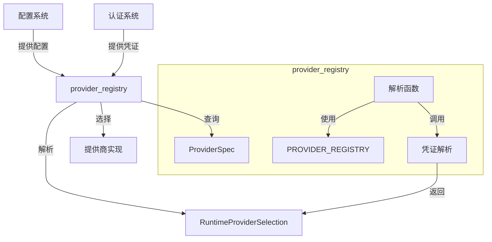

# Provider Registry 模块文档

## 目录
- [概述](#概述)
- [核心组件](#核心组件)
- [架构设计](#架构设计)
- [功能模块](#功能模块)
- [使用指南](#使用指南)
- [测试与验证](#测试与验证)
- [扩展性与未来方向](#扩展性与未来方向)

---

## 概述

`provider_registry` 模块是整个系统的核心基础设施组件，负责管理和解析 LLM（大型语言模型）提供商的元数据、配置和运行时选择。该模块的主要作用是：

1. **统一提供商管理**：集中存储所有支持的 LLM 提供商的元数据信息
2. **智能解析与选择**：根据配置和优先级自动选择合适的运行时提供商
3. **凭证管理**：支持多种认证方式（API Key、OAuth）并智能解析
4. **灵活配置**：允许用户自定义 API 基础 URL 和其他提供商特定设置

### 设计理念

该模块遵循以下设计原则：
- **优先级驱动**：提供商选择按照预定义的优先级顺序进行
- **声明式配置**：通过配置而非代码来决定使用哪个提供商
- **向后兼容**：保持 API 稳定性，同时支持新功能
- **安全性优先**：安全地处理和存储认证凭证

---

## 核心组件

### ProviderSpec

`ProviderSpec` 是一个描述 LLM 提供商元数据的结构体，包含了提供商的所有关键信息。

```rust
pub struct ProviderSpec {
    pub name: &'static str,
    pub model_keywords: &'static [&'static str],
    pub runtime_supported: bool,
    pub default_base_url: Option<&'static str>,
    pub backend: &'static str,
}
```

**字段说明：**
- `name`：提供商的唯一标识符，如 "openai"、"anthropic"
- `model_keywords`：与该提供商相关联的模型关键词列表，用于模型识别
- `runtime_supported`：标识该提供商是否在当前运行时中受支持
- `default_base_url`：提供商的默认 API 基础 URL（可选）
- `backend`：底层后端类型，目前支持 "openai" 和 "anthropic"

### RuntimeProviderSelection

`RuntimeProviderSelection` 表示运行时准备就绪的提供商选择，包含了实际执行所需的所有信息。

```rust
pub struct RuntimeProviderSelection {
    pub name: &'static str,
    pub api_key: String,
    pub api_base: Option<String>,
    pub backend: &'static str,
    pub credential: ResolvedCredential,
}
```

**字段说明：**
- `name`：选定的提供商标识符
- `api_key`：用于认证的 API 密钥（保留用于向后兼容）
- `api_base`：可选的自定义 API 基础 URL
- `backend`：底层后端类型
- `credential`：解析后的凭证（OAuth 令牌或 API 密钥）

### PROVIDER_REGISTRY

这是一个按优先级排序的提供商注册表常量，包含了系统支持的所有提供商。

```rust
pub const PROVIDER_REGISTRY: &[ProviderSpec] = &[
    ProviderSpec {
        name: "anthropic",
        model_keywords: &["anthropic", "claude"],
        runtime_supported: true,
        default_base_url: None,
        backend: "anthropic",
    },
    // 更多提供商...
];
```

当前支持的提供商包括：
- anthropic
- openai
- openrouter
- groq
- zhipu
- vllm
- gemini
- ollama
- nvidia

---

## 架构设计

### 系统架构图



### 工作流程

整个提供商选择和解析过程遵循以下步骤：

1. **配置加载**：从配置系统加载提供商配置
2. **优先级遍历**：按照 `PROVIDER_REGISTRY` 的顺序检查每个提供商
3. **配置验证**：检查提供商是否有有效的配置（如 API 密钥）
4. **凭证解析**：根据配置的认证方法解析相应的凭证
5. **运行时选择**：创建 `RuntimeProviderSelection` 对象供运行时使用

---

## 功能模块

### 1. 提供商配置查询

#### provider_config_by_name

根据提供商名称从配置中获取相应的提供商配置。

```rust
pub fn provider_config_by_name<'a>(config: &'a Config, name: &str) -> Option<&'a ProviderConfig>
```

**参数：**
- `config`：应用配置对象
- `name`：提供商名称

**返回值：**
- 成功时返回 `Some(&ProviderConfig)`，否则返回 `None`

**实现细节：**
该函数使用模式匹配将提供商名称映射到配置对象中的相应字段，是配置查询的基础函数。

### 2. 配置提供商列表

#### configured_provider_names

返回所有已配置的提供商名称，按照注册表顺序排列。

```rust
pub fn configured_provider_names(config: &Config) -> Vec<&'static str>
```

**参数：**
- `config`：应用配置对象

**返回值：**
- 已配置的提供商名称列表

**工作原理：**
遍历 `PROVIDER_REGISTRY`，检查每个提供商是否有有效的 API 密钥配置，返回所有符合条件的提供商名称。

#### configured_unsupported_provider_names

返回已配置但当前不支持运行时执行的提供商名称。

```rust
pub fn configured_unsupported_provider_names(config: &Config) -> Vec<&'static str>
```

**参数：**
- `config`：应用配置对象

**返回值：**
- 已配置但不支持的提供商名称列表

### 3. 运行时提供商解析

#### resolve_runtime_provider

解析当前运行时使用的单个提供商（返回优先级最高的可用提供商）。

```rust
pub fn resolve_runtime_provider(config: &Config) -> Option<RuntimeProviderSelection>
```

**参数：**
- `config`：应用配置对象

**返回值：**
- 成功时返回 `Some(RuntimeProviderSelection)`，否则返回 `None`

**使用场景：**
当只需要一个提供商进行交互时使用，例如单次 API 调用。

#### resolve_runtime_providers

解析所有运行时支持且已配置的提供商，按照注册表顺序排列。

```rust
pub fn resolve_runtime_providers(config: &Config) -> Vec<RuntimeProviderSelection>
```

**参数：**
- `config`：应用配置对象

**返回值：**
- 解析后的运行时提供商选择列表

**详细流程：**
1. 尝试加载用于 OAuth 解析的令牌存储
2. 遍历所有运行时支持的提供商
3. 对每个提供商，根据配置的认证方法解析凭证
4. 构建 `RuntimeProviderSelection` 对象并收集到结果列表中

**认证方法支持：**
- `api_key`：仅使用配置的 API 密钥
- `oauth`：仅使用 OAuth 令牌
- `auto`：先尝试 OAuth，失败则回退到 API 密钥

### 4. 凭证解析

#### resolve_credential

为单个提供商解析凭证。

```rust
fn resolve_credential(
    provider_name: &str,
    auth_method: &AuthMethod,
    provider_config: Option<&ProviderConfig>,
    token_store: Option<&crate::auth::store::TokenStore>,
) -> Option<(ResolvedCredential, String)>
```

**参数：**
- `provider_name`：提供商名称
- `auth_method`：认证方法
- `provider_config`：提供商配置（可选）
- `token_store`：令牌存储（可选）

**返回值：**
- 成功时返回 `Some((ResolvedCredential, String))`，否则返回 `None`

#### try_load_oauth_token

尝试从存储中加载有效的 OAuth 令牌。

```rust
fn try_load_oauth_token(
    provider_name: &str,
    token_store: Option<&crate::auth::store::TokenStore>,
) -> Option<ResolvedCredential>
```

**参数：**
- `provider_name`：提供商名称
- `token_store`：令牌存储（可选）

**返回值：**
- 成功时返回 `Some(ResolvedCredential::BearerToken)`，否则返回 `None`

**重要说明：**
- 过期的令牌会被忽略
- 调用者需要单独处理令牌刷新（CLI 在启动时执行此操作）

---

## 使用指南

### 基本使用示例

#### 1. 获取已配置的提供商列表

```rust
use crate::providers::registry::configured_provider_names;

let config = Config::load(); // 假设有加载配置的方法
let providers = configured_provider_names(&config);
println!("已配置的提供商: {:?}", providers);
```

#### 2. 解析运行时提供商

```rust
use crate::providers::registry::resolve_runtime_provider;

let config = Config::load();
if let Some(provider) = resolve_runtime_provider(&config) {
    println!("使用提供商: {}", provider.name);
    println!("API 基础 URL: {:?}", provider.api_base);
    // 使用 provider 进行 API 调用...
} else {
    eprintln!("没有可用的运行时提供商");
}
```

#### 3. 获取所有运行时支持的提供商

```rust
use crate::providers::registry::resolve_runtime_providers;

let config = Config::load();
let providers = resolve_runtime_providers(&config);
println!("可用的运行时提供商数量: {}", providers.len());
for provider in providers {
    println!("- {} (后端: {})", provider.name, provider.backend);
}
```

### 配置示例

#### 基本配置

```yaml
providers:
  openai:
    api_key: "sk-your-openai-api-key"
  anthropic:
    api_key: "sk-your-anthropic-api-key"
```

#### 自定义 API 基础 URL

```yaml
providers:
  openai:
    api_key: "sk-your-api-key"
    api_base: "https://your-custom-endpoint.com/v1"
```

#### OAuth 认证配置

```yaml
providers:
  anthropic:
    api_key: "sk-fallback-key"  # 可选的回退密钥
    auth_method: "oauth"  # 或 "auto"
```

### 扩展新提供商

要添加新的提供商，需要：

1. 在 `PROVIDER_REGISTRY` 中添加新的 `ProviderSpec` 条目
2. 在 `provider_config_by_name` 函数中添加对应的匹配分支
3. 确保配置系统中有相应的配置字段
4. 如有必要，在相应的后端实现中添加支持

---

## 测试与验证

该模块包含全面的测试覆盖，验证了以下场景：

1. **配置提供商顺序**：确保按注册表顺序返回已配置的提供商
2. **不支持提供商检测**：验证正确识别已配置但不支持的提供商
3. **运行时提供商优先级**：确保正确选择优先级最高的提供商
4. **API 基础 URL 解析**：验证默认和自定义 URL 的正确处理
5. **OAuth 令牌处理**：验证过期令牌的处理和自动回退机制
6. **各种提供商的特定测试**：如 groq、ollama、gemini 等

### 运行测试

```bash
cargo test --package your-package-name --lib providers::registry::tests
```

---

## 扩展性与未来方向

### 当前限制

1. **固定注册表**：当前 `PROVIDER_REGISTRY` 是编译时常量，无法在运行时动态添加提供商
2. **有限的后端支持**：目前仅支持 "openai" 和 "anthropic" 两种后端类型
3. **认证方法**：主要支持 API Key 和 OAuth，可能需要扩展其他认证方式

### 未来改进方向

1. **动态提供商注册**：支持在运行时注册新的提供商
2. **插件系统**：通过插件机制扩展提供商支持
3. **更丰富的配置选项**：支持提供商特定的高级配置
4. **自动重试和故障转移**：集成更强大的错误处理和故障转移机制
5. **性能优化**：对于频繁调用的场景，考虑添加缓存机制

---

## 相关模块

- [provider_types](provider_types.md)：提供商类型定义
- [provider_fallback](provider_fallback.md)：提供商回退机制
- [provider_retry](provider_retry.md)：提供商重试机制
- [provider_rotation](provider_rotation.md)：提供商轮换机制
- [configuration](configuration.md)：配置系统

---

*最后更新时间：2024年*
