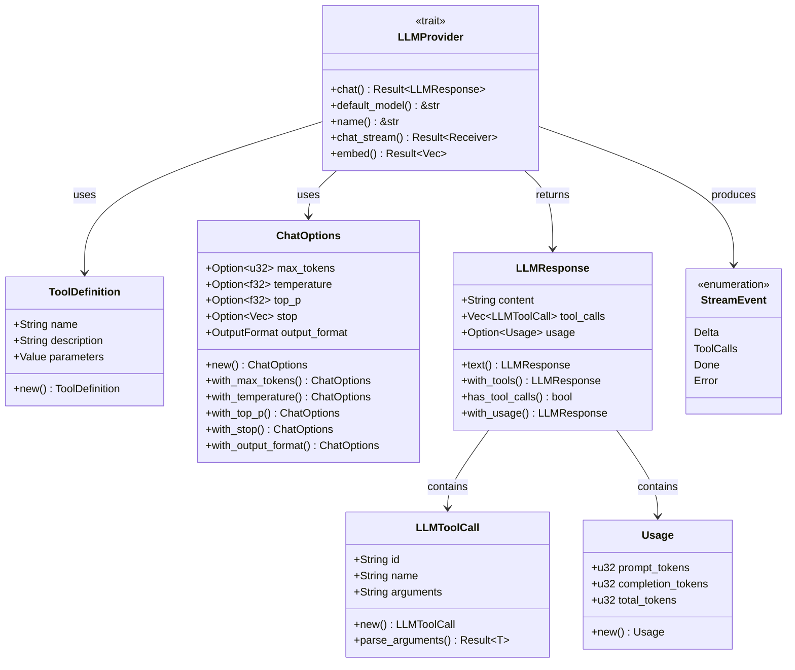
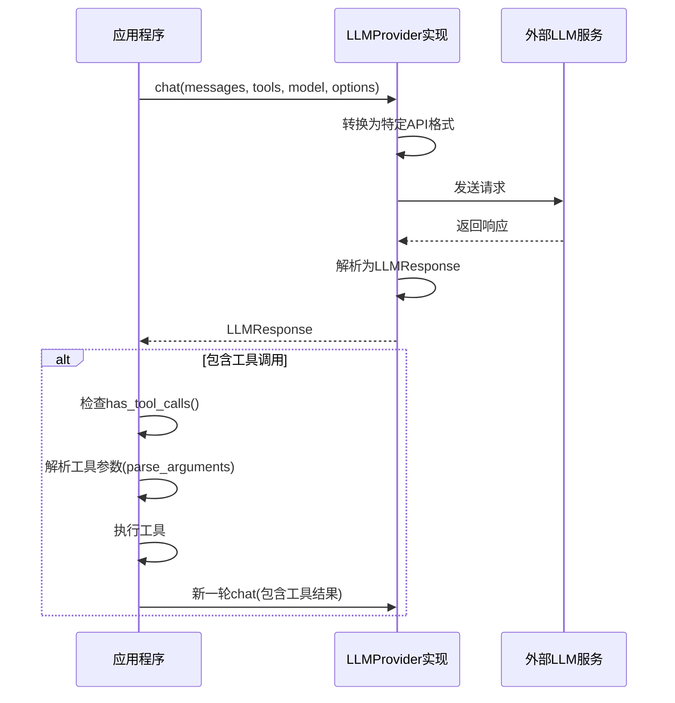

# provider_types 模块文档

## 1. 模块概述

provider_types 模块是 ZeptoClaw 系统中用于定义 LLM（大型语言模型）提供者核心类型和接口的基础模块。该模块建立了一套统一的抽象层，使得系统能够以一致的方式与不同的 LLM 提供者（如 OpenAI、Anthropic、Gemini 等）进行交互，同时支持工具调用、流式响应和文本嵌入等高级功能。

该模块的设计目的是解耦系统核心逻辑与具体 LLM 提供者实现，通过定义标准接口和数据结构，使得添加新的 LLM 提供者变得简单，同时保持系统其他部分的稳定性。

## 2. 核心组件架构

provider_types 模块的核心组件可以分为以下几个主要部分：

1. **数据结构类型**：定义了工具定义、工具调用、使用情况和响应等数据结构
2. **核心接口**：LLMProvider trait，是所有 LLM 提供者必须实现的核心接口
3. **配置选项**：ChatOptions，用于配置聊天请求的各种参数
4. **流式事件**：StreamEvent，用于处理流式响应过程中的各种事件

下图展示了这些核心组件之间的关系：



## 3. 核心组件详解

### 3.1 ToolDefinition

ToolDefinition 结构定义了 LLM 可以调用的工具的元数据。它包含工具的名称、描述和参数 schema，是连接 LLM 和可用工具的桥梁。

```rust
pub struct ToolDefinition {
    /// 工具的名称（必须唯一）
    pub name: String,
    /// 工具功能的人类可读描述
    pub description: String,
    /// 描述工具参数的 JSON Schema
    pub parameters: serde_json::Value,
}
```

**主要功能**：
- 提供工具的唯一标识符和描述
- 通过 JSON Schema 定义工具参数的结构和验证规则
- 支持 LLM 理解如何正确调用工具

**使用示例**：
```rust
let tool = ToolDefinition::new(
    "web_search",
    "Search the web for information",
    json!({
        "type": "object",
        "properties": {
            "query": { "type": "string", "description": "Search query" }
        },
        "required": ["query"]
    }),
);
```

### 3.2 LLMProvider trait

LLMProvider 是整个模块的核心 trait，定义了 LLM 提供者必须实现的接口。它提供了聊天、流式聊天和嵌入等功能的抽象。

```rust
#[async_trait]
pub trait LLMProvider: Send + Sync {
    async fn chat(
        &self,
        messages: Vec<Message>,
        tools: Vec<ToolDefinition>,
        model: Option<&str>,
        options: ChatOptions,
    ) -> Result<LLMResponse>;
    
    fn default_model(&self) -> &str;
    fn name(&self) -> &str;
    
    async fn chat_stream(
        &self,
        messages: Vec<Message>,
        tools: Vec<ToolDefinition>,
        model: Option<&str>,
        options: ChatOptions,
    ) -> Result<tokio::sync::mpsc::Receiver<StreamEvent>>;
    
    async fn embed(&self, _texts: &[String]) -> Result<Vec<Vec<f32>>>;
}
```

**主要功能**：
- `chat`：发送非流式聊天请求，返回完整的 LLM 响应
- `chat_stream`：发送流式聊天请求，通过事件流返回响应
- `embed`：将文本转换为向量表示（默认不支持，需要提供者实现）
- `default_model` 和 `name`：提供提供者的元信息

**设计要点**：
- 使用 `async_trait` 允许 trait 包含异步方法
- 提供了 `chat_stream` 和 `embed` 的默认实现，减少新提供者的实现工作量
- 所有方法都设计为可在多线程环境中安全使用（`Send + Sync`）

### 3.3 ChatOptions

ChatOptions 结构用于配置 LLM 聊天请求的各种参数，采用建造者模式提供流畅的 API。

```rust
pub struct ChatOptions {
    /// 生成的最大 token 数
    pub max_tokens: Option<u32>,
    /// 采样温度（0.0 = 确定性，1.0 = 创造性）
    pub temperature: Option<f32>,
    /// 核采样参数
    pub top_p: Option<f32>,
    /// 停止生成的序列
    pub stop: Option<Vec<String>>,
    /// 输出格式（文本、JSON 或 JSON schema）
    pub output_format: OutputFormat,
}
```

**主要功能**：
- 控制生成文本的多样性和创造性（temperature, top_p）
- 限制响应长度（max_tokens）
- 指定生成停止条件（stop）
- 配置结构化输出格式（output_format）

**使用示例**：
```rust
let options = ChatOptions::new()
    .with_max_tokens(1000)
    .with_temperature(0.7)
    .with_top_p(0.9)
    .with_stop(vec!["END".to_string()]);
```

### 3.4 LLMResponse

LLMResponse 结构封装了 LLM 的完整响应，包括文本内容、工具调用和 token 使用情况。

```rust
pub struct LLMResponse {
    /// 响应的文本内容
    pub content: String,
    /// LLM 做出的工具调用（如果有）
    pub tool_calls: Vec<LLMToolCall>,
    /// Token 使用信息（如果可用）
    pub usage: Option<Usage>,
}
```

**主要功能**：
- 存储 LLM 返回的文本内容
- 封装 LLM 请求的工具调用
- 记录 token 使用情况，便于成本计算和预算控制

**便捷方法**：
- `text(content)`：创建仅包含文本的响应
- `with_tools(content, tool_calls)`：创建包含工具调用的响应
- `has_tool_calls()`：检查响应是否包含工具调用
- `with_usage(usage)`：添加使用情况信息

### 3.5 LLMToolCall

LLMToolCall 结构表示 LLM 发起的工具调用请求，包含调用 ID、工具名称和参数。

```rust
pub struct LLMToolCall {
    /// 此工具调用的唯一标识符
    pub id: String,
    /// 要执行的工具名称
    pub name: String,
    /// 工具的 JSON 编码参数
    pub arguments: String,
}
```

**主要功能**：
- 唯一标识每个工具调用，便于跟踪和关联结果
- 指定要调用的工具名称
- 传递工具调用所需的参数

**便捷方法**：
- `new(id, name, arguments)`：创建新的工具调用
- `parse_arguments<T>()`：将 JSON 字符串参数解析为特定类型

**使用示例**：
```rust
#[derive(Deserialize)]
struct SearchArgs {
    query: String,
}

let call = LLMToolCall::new("call_1", "search", r#"{"query": "rust"}"#);
let args: SearchArgs = call.parse_arguments().unwrap();
assert_eq!(args.query, "rust");
```

### 3.6 Usage

Usage 结构记录了一次 LLM 请求的 token 使用情况，用于成本计算和资源监控。

```rust
pub struct Usage {
    /// 提示中的 token 数
    pub prompt_tokens: u32,
    /// 补全中的 token 数
    pub completion_tokens: u32,
    /// 使用的总 token 数（提示 + 补全）
    pub total_tokens: u32,
}
```

**主要功能**：
- 分别跟踪提示和补全的 token 使用量
- 自动计算总 token 数
- 为成本追踪和预算控制提供数据基础

### 3.7 StreamEvent

StreamEvent 枚举定义了流式响应过程中可能发生的各种事件，支持实时处理 LLM 输出。

```rust
pub enum StreamEvent {
    /// LLM 的文本内容块
    Delta(String),
    /// 流中检测到的工具调用（触发回退到非流式工具循环）
    ToolCalls(Vec<LLMToolCall>),
    /// 流完成 — 携带完整组装的内容和使用统计
    Done {
        content: String,
        usage: Option<Usage>,
    },
    /// 流中的提供者错误
    Error(ZeptoError),
}
```

**主要功能**：
- `Delta`：传递增量文本内容，支持实时显示
- `ToolCalls`：指示 LLM 在流式输出中请求工具调用
- `Done`：标志流结束，并提供完整内容和使用统计
- `Error`：传递流式处理过程中发生的错误

## 4. 工作流程

provider_types 模块在 LLM 交互过程中的典型工作流程如下：

1. **准备阶段**：
   - 创建 `ToolDefinition` 实例，定义可用工具
   - 使用 `ChatOptions` 配置请求参数
   - 准备对话历史 `Vec<Message>`

2. **请求阶段**：
   - 调用 `LLMProvider` 的 `chat` 或 `chat_stream` 方法
   - 提供者将内部数据结构转换为特定 LLM API 的格式
   - 发送请求到 LLM 服务

3. **响应处理阶段**：
   - 接收 LLM 响应并转换为 `LLMResponse` 或 `StreamEvent`
   - 检查是否有工具调用（`has_tool_calls()`）
   - 如有，解析工具调用参数并执行相应工具
   - 记录 token 使用情况

以下是典型的非流式交互流程图：



## 5. 扩展与实现指南

要创建新的 LLM 提供者，需要遵循以下步骤：

1. **实现 LLMProvider trait**：
   ```rust
   struct MyProvider {
       // 提供者特定字段
       api_key: String,
       default_model: String,
   }
   
   #[async_trait]
   impl LLMProvider for MyProvider {
       async fn chat(
           &self,
           messages: Vec<Message>,
           tools: Vec<ToolDefinition>,
           model: Option<&str>,
           options: ChatOptions,
       ) -> Result<LLMResponse> {
           // 实现聊天逻辑
       }
       
       fn default_model(&self) -> &str {
           &self.default_model
       }
       
       fn name(&self) -> &str {
           "my_provider"
       }
       
       // 可选：覆盖chat_stream实现原生流式支持
       // 可选：覆盖embed实现文本嵌入功能
   }
   ```

2. **数据转换**：
   - 将系统的 `Message` 类型转换为提供者 API 所需格式
   - 将 `ToolDefinition` 转换为提供者期望的工具表示
   - 解析提供者响应并构建 `LLMResponse`

3. **错误处理**：
   - 将提供者特定错误映射到 `ZeptoError`
   - 实现适当的重试和回退逻辑（可参考 [provider_fallback](provider_fallback.md) 和 [provider_retry](provider_retry.md)）

4. **性能考虑**：
   - 实现连接池和请求复用
   - 添加适当的缓存策略
   - 考虑流式响应的资源管理

## 6. 注意事项与限制

1. **线程安全**：所有 `LLMProvider` 实现必须是 `Send + Sync`，确保可以在多线程环境中安全使用。

2. **错误处理**：
   - 默认的 `embed` 实现会返回错误，使用前应检查提供者是否支持
   - 流式响应中的错误通过 `StreamEvent::Error` 传递，需要适当处理

3. **工具调用**：
   - 工具名称必须唯一，避免冲突
   - 工具参数应使用有效的 JSON Schema 定义
   - 在流式响应中检测到工具调用时，系统会回退到非流式处理模式

4. **性能考虑**：
   - 对于频繁调用，考虑使用缓存（可参考配置模块中的 [CacheConfig](configuration.md)）
   - 大文本的嵌入可能消耗较多资源，注意批处理大小

5. **序列化兼容性**：
   - 所有核心类型都实现了 `Serialize` 和 `Deserialize`，确保可以安全地进行序列化
   - 当跨版本使用时，注意结构变更可能导致的兼容性问题

## 7. 相关模块

provider_types 模块与以下模块密切相关：

- [provider_registry](provider_registry.md)：负责提供者的注册和选择
- [provider_fallback](provider_fallback.md)：提供提供者故障转移功能
- [provider_retry](provider_retry.md)：实现请求重试逻辑
- [provider_rotation](provider_rotation.md)：支持多个提供者之间的轮询
- [tooling_framework](tooling_framework.md)：定义和管理实际工具实现
- [configuration](configuration.md)：提供系统配置，包括提供者配置

通过这些模块的协同工作，ZeptoClaw 系统能够构建灵活、可靠和高性能的 LLM 交互层。
