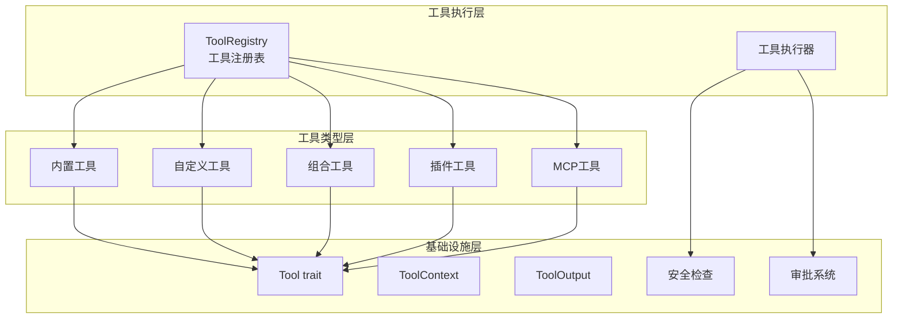

# 工具框架 (Tooling Framework)

## 概述

工具框架是 ZeptoClaw 系统的核心组件，提供了一套完整的工具定义、注册、管理和执行机制。该框架允许大型语言模型（LLM）通过函数调用的方式与外部世界交互，执行各种操作如文件系统访问、网络请求、消息发送等。

### 设计理念

工具框架采用了模块化、可扩展的设计：
- **统一接口**：所有工具实现相同的 `Tool` trait，确保一致性
- **安全第一**：内置多层安全检查，防止危险操作
- **灵活配置**：支持多种配置方式，适应不同使用场景
- **易于扩展**：提供多种方式创建自定义工具，无需修改核心代码

### 核心功能

- 工具注册与发现
- 工具执行与参数验证
- 多类工具支持（内置、自定义、组合、插件）
- 安全检查与审批机制
- 工作区隔离与路径验证

## 架构设计



### 核心组件说明

#### 1. 工具注册表 (ToolRegistry)

工具注册表是整个框架的核心，负责管理所有可用工具的生命周期。它提供工具注册、查找、执行等功能。

主要职责：
- 工具注册与注销
- 工具定义生成（用于 LLM）
- 工具执行调度
- 执行日志记录

#### 2. 工具执行上下文 (ToolContext)

工具执行上下文提供工具运行时的环境信息，包括：
- 渠道信息（telegram、slack、discord 等）
- 聊天 ID
- 工作区路径

#### 3. 工具输出 (ToolOutput)

工具输出采用双受众设计，区分 LLM 看到的内容和用户看到的内容：
- `for_llm`：发送给 LLM 的完整结果
- `for_user`：用户可见的内容（可选）
- `is_error`：是否表示错误
- `is_async`：是否异步执行

#### 4. 工具分类 (ToolCategory)

工具按功能和风险等级分类，用于代理模式执行控制：

```rust
pub enum ToolCategory {
    FilesystemRead,   // 只读文件系统操作
    FilesystemWrite,  // 写入文件系统操作
    NetworkRead,      // 只读网络操作
    NetworkWrite,     // 修改外部状态的网络操作
    Shell,            // Shell 命令执行
    Hardware,         // 硬件/外设操作
    Memory,           // 内存读写操作
    Messaging,        // 消息发送操作
    Destructive,      // 破坏性或高风险操作
}
```

## 工具类型

### 1. 内置工具

内置工具是框架提供的标准工具，覆盖常见使用场景：

| 工具名称 | 分类 | 描述 |
|---------|------|------|
| `echo` | Shell | 简单的回显工具，用于测试 |
| `read_file` | FilesystemRead | 读取文件内容 |
| `write_file` | FilesystemWrite | 写入文件内容 |
| `list_dir` | FilesystemRead | 列出目录内容 |
| `edit_file` | FilesystemWrite | 编辑文件内容 |
| `shell` | Shell | 执行 Shell 命令 |
| `web_search` | NetworkRead | 网络搜索 |
| `web_fetch` | NetworkRead | 获取网页内容 |
| `message` | Messaging | 发送消息 |
| `http_request` | NetworkWrite | 发送 HTTP 请求 |

详细文档请参考：[内置工具说明](builtin_tools.md)

### 2. 自定义工具

自定义工具允许用户通过配置定义 Shell 命令工具，无需编写代码：

```json
{
  "name": "my_tool",
  "description": "我的自定义工具",
  "command": "echo {{param}}",
  "parameters": {
    "param": "string"
  }
}
```

详细文档请参考：[自定义工具](custom_tools.md)

### 3. 组合工具

组合工具允许用户通过自然语言描述创建新工具，系统会将这些描述转换为代理可执行的指令：

```json
{
  "name": "summarize_url",
  "description": "获取 URL 并返回 3 点摘要",
  "action": "获取 {{url}} 的网页内容并生成简洁的 3 点摘要",
  "parameters": {
    "url": {
      "param_type": "string",
      "description": "要摘要的 URL",
      "required": true
    }
  }
}
```

详细文档请参考：[组合工具](composed_tools.md)

### 4. 插件工具

插件工具支持从外部插件加载工具定义，包括：
- 脚本插件
- 二进制插件
- 渠道插件

详细文档请参考：[插件工具](plugin_tools.md)

### 5. MCP 工具

MCP (Model Context Protocol) 工具支持与 MCP 服务器交互，提供标准的工具发现和调用机制：

- 工具列表获取（带缓存）
- 工具调用
- 初始化握手

详细文档请参考：[MCP 工具](mcp_tools.md)

## 安全机制

### 1. 工作区隔离

所有文件系统操作都限制在配置的工作区内，通过 `validate_path_in_workspace` 函数进行路径验证，防止路径遍历攻击。

### 2. Shell 安全

Shell 工具执行前会通过 `ShellSecurityConfig` 检查命令，阻止危险模式：

- 递归删除（`rm -rf`）
- 系统修改命令
- 网络监听命令
- 等等

### 3. 网络安全

网络工具内置 SSRF 防护：
- 阻止私有/本地 IP 地址
- 阻止 localhost 和 .local 域名
- DNS 解析检查
- 重定向目标检查

### 4. 审批系统

提供可选的审批机制，可以在工具执行前要求用户确认：

- `AlwaysAllow`：所有工具无需审批
- `AlwaysRequire`：所有工具都需要审批
- `RequireForTools`：仅指定工具需要审批
- `RequireForDangerous`：危险工具需要审批

详细文档请参考：[审批系统](approval_system.md)

## 使用示例

### 基本使用

```rust
use zeptoclaw::tools::{ToolRegistry, EchoTool, ReadFileTool, ShellTool};
use serde_json::json;

#[tokio::main]
async fn main() -> Result<()> {
    // 创建注册表
    let mut registry = ToolRegistry::new();
    
    // 注册工具
    registry.register(Box::new(EchoTool));
    registry.register(Box::new(ReadFileTool));
    registry.register(Box::new(ShellTool::new()));
    
    // 执行工具
    let result = registry.execute("echo", json!({"message": "Hello!"})).await?;
    println!("Result: {}", result.for_llm);
    
    Ok(())
}
```

### 获取工具定义

```rust
// 获取所有工具定义（用于 LLM）
let definitions = registry.definitions();

// 获取特定工具定义
let selected = registry.definitions_for_tools(&["read_file", "write_file"]);

// 获取精简描述版本（节省 token）
let compact = registry.definitions_with_options(true);
```

### 带上下文执行

```rust
use zeptoclaw::tools::ToolContext;

let ctx = ToolContext::new()
    .with_channel("telegram", "123456")
    .with_workspace("/home/user/project");

let result = registry.execute_with_context(
    "read_file",
    json!({"path": "README.md"}),
    &ctx
).await?;
```

## 配置选项

### 工具配置

工具框架通过项目配置进行管理：

```json
{
  "tools": {
    "http_request": {
      "allowed_domains": ["api.example.com", "*.myco.com"],
      "timeout_secs": 30,
      "max_response_bytes": 524288
    }
  },
  "approval": {
    "enabled": true,
    "policy": "require_for_dangerous",
    "dangerous_tools": ["shell", "write_file", "edit_file"]
  }
}
```

### 自定义工具配置

自定义工具可以在配置文件中定义：

```json
{
  "custom_tools": [
    {
      "name": "cpu_temp",
      "description": "获取 CPU 温度",
      "command": "sensors | grep 'Core 0' | awk '{print $3}'",
      "timeout_secs": 10
    }
  ]
}
```

## 扩展开发

### 创建新工具

要创建新工具，只需实现 `Tool` trait：

```rust
use async_trait::async_trait;
use serde_json::{json, Value};
use zeptoclaw::tools::{Tool, ToolContext, ToolOutput, ToolCategory};
use zeptoclaw::error::Result;

struct MyTool;

#[async_trait]
impl Tool for MyTool {
    fn name(&self) -> &str {
        "my_tool"
    }

    fn description(&self) -> &str {
        "我的自定义工具描述"
    }

    fn category(&self) -> ToolCategory {
        ToolCategory::Memory
    }

    fn parameters(&self) -> Value {
        json!({
            "type": "object",
            "properties": {
                "param": {
                    "type": "string",
                    "description": "参数描述"
                }
            },
            "required": ["param"]
        })
    }

    async fn execute(&self, args: Value, ctx: &ToolContext) -> Result<ToolOutput> {
        let param = args.get("param")
            .and_then(|v| v.as_str())
            .ok_or_else(|| zeptoclaw::error::ZeptoError::Tool("缺少参数".into()))?;
        
        Ok(ToolOutput::llm_only(format!("处理结果: {}", param)))
    }
}
```

## 相关模块

- [代理核心](agent_core.md)：工具的主要消费者
- [配置系统](configuration.md)：工具配置管理
- [插件系统](plugin_and_extension_system.md)：插件工具集成
- [安全与防护](safety_and_security.md)：安全机制详细说明

## 最佳实践

1. **工作区配置**：始终配置工作区，避免绝对路径操作
2. **工具分类**：正确设置工具分类，确保代理模式安全
3. **审批启用**：在生产环境中建议启用审批系统
4. **参数验证**：在工具执行前验证所有输入参数
5. **错误处理**：提供清晰的错误信息，帮助 LLM 理解和修正
6. **输出大小**：限制输出大小，避免耗尽 LLM 上下文窗口
7. **超时设置**：为长时间运行的工具设置合理的超时

## 限制与注意事项

- 所有文件系统操作都需要配置工作区
- 网络操作默认阻止私有地址，需要显式允许
- 组合工具通过自然语言工作，结果可能不够精确
- 插件工具需要额外的安全审查
- MCP 工具需要服务器配合实现协议
