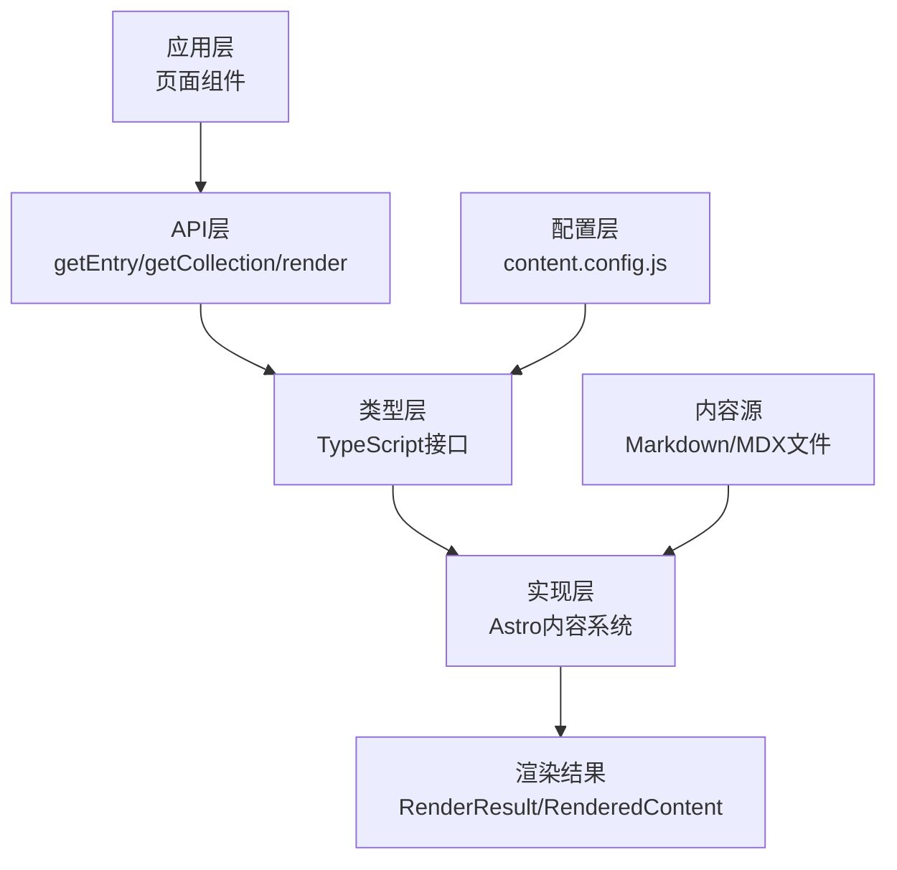
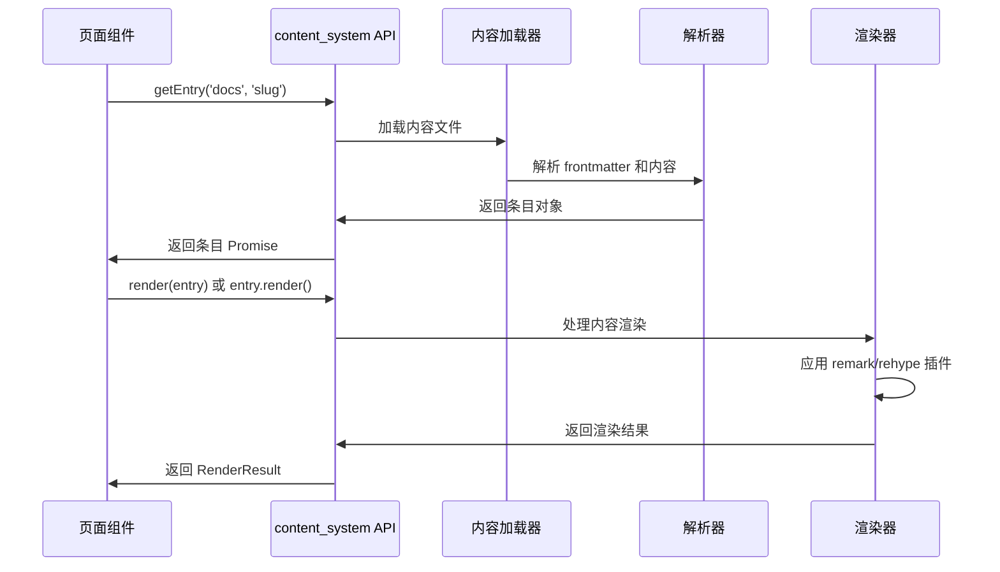

# content_system 模块文档

## 模块概述

content_system 模块是基于 Astro 内容集合系统构建的核心内容管理模块，负责处理文档内容的渲染、获取和管理。该模块提供了类型安全的内容访问接口，支持 Markdown 和 MDX 格式的文档处理，并提供了丰富的元数据提取功能。

### 设计目的

该模块的设计旨在解决以下问题：
- 提供类型安全的内容访问方式，避免运行时错误
- 统一处理不同格式（Markdown、MDX）的文档渲染
- 支持内容集合的组织和查询
- 提供丰富的元数据提取和处理能力
- 支持内容之间的引用关系管理

## 核心组件详解

### Render 接口

`Render` 接口定义了不同内容格式的渲染契约，是模块的核心渲染抽象层。

```typescript
interface Render {
    '.mdx': Promise<{
        Content: import('astro').MDXContent;
        headings: import('astro').MarkdownHeading[];
        remarkPluginFrontmatter: Record<string, any>;
        components: import('astro').MDXInstance<{}>['components'];
    }>;
    '.md': Promise<RenderResult>;
}
```

#### 功能说明

`Render` 接口根据文件扩展名提供不同的渲染结果：

- **.mdx 格式**：返回完整的 MDX 渲染结果，包含可交互的组件
- **.md 格式**：返回标准的 Markdown 渲染结果，通过 `RenderResult` 接口封装

#### 参数与返回值

该接口不是传统意义上的函数，而是一个类型映射，将文件扩展名映射到对应的渲染结果类型。每种格式都返回一个 Promise，确保渲染过程是异步的。

#### 使用场景

当需要处理不同格式的内容文件时，`Render` 接口提供了类型安全的方式来访问渲染结果，开发者可以根据文件类型获得正确的类型提示。

### RenderResult 接口

`RenderResult` 接口封装了 Markdown 内容的渲染结果，是最常用的渲染输出格式。

```typescript
export interface RenderResult {
    Content: import('astro/runtime/server/index.js').AstroComponentFactory;
    headings: import('astro').MarkdownHeading[];
    remarkPluginFrontmatter: Record<string, any>;
}
```

#### 功能说明

`RenderResult` 提供了三个核心组件：

1. **Content**：Astro 组件工厂，可以直接在 Astro 页面中渲染
2. **headings**：文档标题数组，用于生成目录导航
3. **remarkPluginFrontmatter**：通过 remark 插件提取的前置元数据

#### 详细属性说明

- **Content**：这是一个 Astro 组件工厂函数，调用后可以生成可渲染的组件。它包含了文档的主要内容，支持所有 Astro 组件的特性。

- **headings**：`MarkdownHeading[]` 类型，每个元素包含：
  - `depth`：标题级别（1-6）
  - `slug`：标题的 URL 友好标识符
  - `text`：标题文本内容

- **remarkPluginFrontmatter**：灵活的键值对对象，包含文档的元数据，如标题、作者、日期等。

#### 使用示例

```typescript
import { getEntry, render } from 'astro:content';

// 获取文档条目
const entry = await getEntry('docs', 'getting-started');
// 渲染文档
const result = await render(entry);

// 在 Astro 组件中使用
---
const { Content, headings } = result;
---

<!-- 渲染文档内容 -->
<Content />

<!-- 渲染目录 -->
<nav>
  {headings.map(heading => (
    <a href={`#${heading.slug}`} style={{ paddingLeft: `${(heading.depth - 1) * 1}rem` }}>
      {heading.text}
    </a>
  ))}
</nav>
```

### RenderedContent 接口

`RenderedContent` 接口提供了预渲染内容的封装，适用于不需要动态组件的场景。

```typescript
export interface RenderedContent {
    html: string;
    metadata?: {
        imagePaths: Array<string>;
        [key: string]: unknown;
    };
}
```

#### 功能说明

与 `RenderResult` 不同，`RenderedContent` 提供的是纯 HTML 字符串，而不是可交互的组件。这使得它适用于：
- 静态内容缓存
- RSS  feed 生成
- 搜索引擎优化（SEO）处理
- 不需要交互功能的内容展示

#### 详细属性说明

- **html**：完整的 HTML 字符串，包含文档的所有内容
- **metadata**：可选的元数据对象，包含：
  - `imagePaths`：文档中引用的所有图片路径数组
  - 其他自定义元数据，通过索引签名支持扩展

## 内容集合管理

content_system 模块提供了一套完整的内容集合管理 API，用于组织、查询和访问内容。

### 核心类型定义

#### CollectionKey 和 CollectionEntry

```typescript
export type CollectionKey = keyof AnyEntryMap;
export type CollectionEntry<C extends CollectionKey> = Flatten<AnyEntryMap[C]>;
```

这些类型提供了类型安全的集合访问方式：
- `CollectionKey`：所有可用集合的名称联合类型
- `CollectionEntry`：特定集合中条目的类型

#### ContentCollectionKey 和 DataCollectionKey

```typescript
export type ContentCollectionKey = keyof ContentEntryMap;
export type DataCollectionKey = keyof DataEntryMap;
```

这两个类型进一步细化了集合类型：
- `ContentCollectionKey`：内容集合（如文档、博客文章）
- `DataCollectionKey`：数据集合（如配置、元数据）

### 引用类型

模块提供了三种引用类型，用于建立内容之间的关系：

#### ReferenceContentEntry

```typescript
export type ReferenceContentEntry<
    C extends keyof ContentEntryMap,
    E extends ValidContentEntrySlug<C> | (string & {}) = string,
> = {
    collection: C;
    slug: E;
};
```

用于引用内容集合中的条目，通过 `slug` 标识。

#### ReferenceDataEntry

```typescript
export type ReferenceDataEntry<
    C extends CollectionKey,
    E extends keyof DataEntryMap[C] = string,
> = {
    collection: C;
    id: E;
};
```

用于引用数据集合中的条目，通过 `id` 标识。

#### ReferenceLiveEntry

```typescript
export type ReferenceLiveEntry<C extends keyof LiveContentConfig['collections']> = {
    collection: C;
    id: string;
};
```

用于引用实时内容集合中的条目。

## 核心 API 函数

### 获取单个条目

#### getEntry 函数

`getEntry` 函数是获取单个内容条目的推荐方式，有多种重载形式：

```typescript
// 通过引用对象获取
export function getEntry<
    C extends keyof ContentEntryMap,
    E extends ValidContentEntrySlug<C> | (string & {}),
>(
    entry: ReferenceContentEntry<C, E>,
): E extends ValidContentEntrySlug<C>
    ? Promise<CollectionEntry<C>>
    : Promise<CollectionEntry<C> | undefined>;

// 通过集合名和 slug 获取
export function getEntry<
    C extends keyof ContentEntryMap,
    E extends ValidContentEntrySlug<C> | (string & {}),
>(
    collection: C,
    slug: E,
): E extends ValidContentEntrySlug<C>
    ? Promise<CollectionEntry<C>>
    : Promise<CollectionEntry<C> | undefined>;

// 通过集合名和 id 获取数据条目
export function getEntry<
    C extends keyof DataEntryMap,
    E extends keyof DataEntryMap[C] | (string & {}),
>(
    collection: C,
    id: E,
): E extends keyof DataEntryMap[C]
    ? string extends keyof DataEntryMap[C]
        ? Promise<DataEntryMap[C][E]> | undefined
        : Promise<DataEntryMap[C][E]>
    : Promise<CollectionEntry<C> | undefined>;
```

##### 功能说明

`getEntry` 函数提供了类型安全的方式来获取单个内容条目，支持多种参数形式以适应不同的使用场景。

##### 参数说明

- **entry/collection**：可以是引用对象或集合名称
- **slug/id**：条目的标识符，内容集合使用 slug，数据集合使用 id

##### 返回值

返回一个 Promise，解析为内容条目对象。如果条目不存在且标识符不是静态已知的有效 slug，则可能返回 undefined。

##### 使用示例

```typescript
import { getEntry } from 'astro:content';

// 方式 1：使用集合名和 slug
const doc = await getEntry('docs', 'introduction');

// 方式 2：使用引用对象
const reference = { collection: 'docs', slug: 'introduction' };
const doc = await getEntry(reference);

// 在 Astro 组件中使用
---
import { getEntry } from 'astro:content';

const doc = await getEntry('docs', Astro.params.slug);
if (!doc) {
  return Astro.redirect('/404');
}

const { Content } = await doc.render();
---

<Content />
```

#### 已废弃的函数

模块保留了两个已废弃的函数，用于向后兼容：

```typescript
/** @deprecated Use `getEntry` instead. */
export function getEntryBySlug<
    C extends keyof ContentEntryMap,
    E extends ValidContentEntrySlug<C> | (string & {}),
>(
    collection: C,
    entrySlug: E,
): E extends ValidContentEntrySlug<C>
    ? Promise<CollectionEntry<C>>
    : Promise<CollectionEntry<C> | undefined>;

/** @deprecated Use `getEntry` instead. */
export function getDataEntryById<C extends keyof DataEntryMap, E extends keyof DataEntryMap[C]>(
    collection: C,
    entryId: E,
): Promise<CollectionEntry<C>>;
```

**注意**：这些函数已被标记为废弃，应使用 `getEntry` 函数替代。

### 获取集合

#### getCollection 函数

```typescript
export function getCollection<C extends keyof AnyEntryMap, E extends CollectionEntry<C>>(
    collection: C,
    filter?: (entry: CollectionEntry<C>) => entry is E,
): Promise<E[]>;
export function getCollection<C extends keyof AnyEntryMap>(
    collection: C,
    filter?: (entry: CollectionEntry<C>) => unknown,
): Promise<CollectionEntry<C>[]>;
```

##### 功能说明

`getCollection` 函数获取整个内容集合，并支持可选的过滤函数来筛选结果。

##### 参数说明

- **collection**：集合名称
- **filter**：可选的过滤函数，返回真值表示保留该条目

##### 返回值

返回一个 Promise，解析为过滤后的条目数组。

##### 使用示例

```typescript
import { getCollection } from 'astro:content';

// 获取所有文档
const allDocs = await getCollection('docs');

// 只获取已发布的文档
const publishedDocs = await getCollection('docs', (doc) => doc.data.published);

// 使用类型谓词进行类型安全的过滤
const guideDocs = await getCollection('docs', (doc): doc is CollectionEntry<'docs'> => 
    doc.data.category === 'guide'
);

// 在 Astro 页面中生成博客列表
---
import { getCollection } from 'astro:content';

const docs = await getCollection('docs');
---

<ul>
  {docs.map(doc => (
    <li>
      <a href={`/docs/${doc.slug}`}>{doc.data.title}</a>
    </li>
  ))}
</ul>
```

### 获取多个条目

#### getEntries 函数

```typescript
export function getEntries<C extends keyof ContentEntryMap>(
    entries: ReferenceContentEntry<C, ValidContentEntrySlug<C>>[],
): Promise<CollectionEntry<C>[]>;
export function getEntries<C extends keyof DataEntryMap>(
    entries: ReferenceDataEntry<C, keyof DataEntryMap[C]>[],
): Promise<CollectionEntry<C>[]>;
```

##### 功能说明

`getEntries` 函数批量获取多个内容条目，适用于需要一次获取多个相关条目的场景。

##### 参数说明

- **entries**：引用对象数组，每个对象指定要获取的条目

##### 返回值

返回一个 Promise，解析为条目对象数组。

##### 使用示例

```typescript
import { getEntries, reference } from 'astro:content';

// 获取相关文档
const relatedDocs = await getEntries([
    { collection: 'docs', slug: 'intro' },
    { collection: 'docs', slug: 'getting-started' },
    { collection: 'docs', slug: 'advanced' }
]);

// 处理文档中的引用
async function processDocumentReferences(doc) {
    const references = doc.data.related || [];
    return getEntries(references);
}
```

### 渲染内容

#### render 函数

```typescript
export function render<C extends keyof AnyEntryMap>(
    entry: AnyEntryMap[C][string],
): Promise<RenderResult>;
```

##### 功能说明

`render` 函数将内容条目渲染为可用的组件和元数据。

##### 参数说明

- **entry**：内容条目对象，通常通过 `getEntry` 或 `getCollection` 获取

##### 返回值

返回一个 Promise，解析为 `RenderResult` 对象。

##### 使用示例

```typescript
import { getEntry, render } from 'astro:content';

const entry = await getEntry('docs', 'introduction');
const result = await render(entry);

// 或者直接使用条目上的 render 方法
const entry = await getEntry('docs', 'introduction');
const result = await entry.render();
```

**注意**：大多数条目对象上都有直接的 `render()` 方法，使用起来更加方便。

### 引用验证

#### reference 函数

```typescript
export function reference<C extends keyof AnyEntryMap>(
    collection: C,
): import('astro/zod').ZodEffects<
    import('astro/zod').ZodString,
    C extends keyof ContentEntryMap
        ? ReferenceContentEntry<C, ValidContentEntrySlug<C>>
        : ReferenceDataEntry<C, keyof DataEntryMap[C]>
>;
export function reference<C extends string>(
    collection: C,
): import('astro/zod').ZodEffects<import('astro/zod').ZodString, never>;
```

##### 功能说明

`reference` 函数创建一个 Zod 验证器，用于验证和转换内容引用。这在定义内容集合模式时非常有用。

##### 参数说明

- **collection**：集合名称

##### 返回值

返回一个 Zod 效应（ZodEffects）对象，它可以将字符串验证并转换为引用对象。

##### 使用示例

```typescript
import { defineCollection, z, reference } from 'astro:content';

const docs = defineCollection({
    schema: z.object({
        title: z.string(),
        // 引用其他文档
        relatedDocs: z.array(reference('docs')).optional(),
        // 引用作者数据
        author: reference('authors'),
    }),
});

export const collections = { docs };
```

### 实时内容函数

模块还提供了处理实时内容的函数：

```typescript
export function getLiveCollection<C extends keyof LiveContentConfig['collections']>(
    collection: C,
    filter?: LiveLoaderCollectionFilterType<C>,
): Promise<
    import('astro').LiveDataCollectionResult<LiveLoaderDataType<C>, LiveLoaderErrorType<C>>
>;

export function getLiveEntry<C extends keyof LiveContentConfig['collections']>(
    collection: C,
    filter: string | LiveLoaderEntryFilterType<C>,
): Promise<import('astro').LiveDataEntryResult<LiveLoaderDataType<C>, LiveLoaderErrorType<C>>>;
```

这些函数用于处理动态加载的实时内容，适用于从外部 API 或数据库获取内容的场景。

## 架构与工作流

### 模块架构

content_system 模块采用分层架构设计，各层职责明确：



### 内容处理流程



## 与其他模块的关系

content_system 模块是文档系统的核心，与其他模块有紧密的协作关系：

### 与 table_of_contents 模块

table_of_contents 模块依赖 content_system 提供的 `headings` 数据来生成目录导航。

```typescript
// 典型的协作模式
import { getEntry } from 'astro:content';
import TableOfContents from '@/components/TableOfContents.astro';

const entry = await getEntry('docs', 'introduction');
const { headings, Content } = await entry.render();

// 在组件中使用
<TableOfContents headings={headings} />
<Content />
```

更多信息请参考 [table_of_contents 模块文档](table_of_contents.md)。

### 与 search_component 模块

search_component 模块使用 content_system 提供的内容集合来构建搜索索引。

```typescript
// 为搜索建立索引
import { getCollection } from 'astro:content';

const docs = await getCollection('docs');
const searchIndex = docs.map(doc => ({
    title: doc.data.title,
    slug: doc.slug,
    content: doc.body,
    // ...其他搜索字段
}));
```

更多信息请参考 [search_component 模块文档](search_component.md)。

## 配置与扩展

### 内容集合配置

content_system 模块的行为主要通过 `src/content/config.js` 文件进行配置：

```javascript
import { defineCollection, z } from 'astro:content';

const docs = defineCollection({
    // 可选：指定内容类型，默认为 'content'
    type: 'content',
    
    // 定义内容模式
    schema: z.object({
        title: z.string(),
        description: z.string(),
        pubDate: z.date(),
        author: z.string(),
        tags: z.array(z.string()).optional(),
        // 可以使用 reference 函数建立内容间的引用
        related: z.array(reference('docs')).optional(),
    }),
});

export const collections = {
    docs,
};
```

### 扩展渲染行为

可以通过 Astro 的集成系统和 remark/rehype 插件来扩展渲染行为：

```javascript
// astro.config.js
import { defineConfig } from 'astro/config';
import mdx from '@astrojs/mdx';
import remarkToc from 'remark-toc';
import rehypeHighlight from 'rehype-highlight';

export default defineConfig({
    integrations: [mdx()],
    markdown: {
        remarkPlugins: [remarkToc],
        rehypePlugins: [rehypeHighlight],
    },
});
```

## 最佳实践

### 1. 类型安全的内容访问

始终使用提供的类型函数，避免类型断言：

```typescript
// ✅ 推荐：类型安全
const doc = await getEntry('docs', 'introduction');
if (doc) {
    const { Content } = await doc.render();
}

// ❌ 不推荐：类型不安全
const doc = await getEntry('docs', 'introduction') as any;
```

### 2. 正确处理不存在的条目

始终检查条目是否存在：

```typescript
const doc = await getEntry('docs', Astro.params.slug);
if (!doc) {
    return Astro.redirect('/404');
    // 或者返回 404 响应
}
```

### 3. 批量获取内容

当需要多个条目时，使用 `getEntries` 而不是多次调用 `getEntry`：

```typescript
// ✅ 推荐
const docs = await getEntries([
    { collection: 'docs', slug: 'intro' },
    { collection: 'docs', slug: 'guide' },
]);

// ❌ 不推荐
const doc1 = await getEntry('docs', 'intro');
const doc2 = await getEntry('docs', 'guide');
```

### 4. 使用集合过滤

使用 `getCollection` 的过滤参数来筛选内容：

```typescript
// ✅ 推荐
const publishedDocs = await getCollection('docs', (doc) => doc.data.published);

// ❌ 不推荐
const allDocs = await getCollection('docs');
const publishedDocs = allDocs.filter((doc) => doc.data.published);
```

## 注意事项与限制

### 已知限制

1. **构建时内容处理**：content_system 主要在构建时处理内容，动态内容需要使用实时内容 API 或服务端渲染。

2. **集合大小限制**：非常大的内容集合可能会增加构建时间，考虑使用分页或按需加载。

3. **类型生成延迟**：在开发模式下，类型定义可能需要一些时间来更新，特别是在添加新内容后。

### 错误处理

1. **条目不存在**：当请求的条目不存在时，`getEntry` 会返回 `undefined`（对于非静态已知的 slug），应始终检查返回值。

2. **渲染错误**：内容渲染可能会失败，特别是在使用自定义插件时，建议添加错误边界。

3. **引用解析**：无效的内容引用会导致构建错误，确保所有引用的内容都存在。

### 性能考虑

1. **缓存渲染结果**：在可能的情况下，缓存渲染结果以避免重复计算。

2. **按需获取内容**：只获取当前页面需要的内容，避免一次性加载整个集合。

3. **图片优化**：使用 `RenderedContent.metadata.imagePaths` 来识别和优化文档中的图片。

## 总结

content_system 模块提供了一个强大而灵活的内容管理系统，它通过类型安全的 API、统一的渲染接口和丰富的元数据处理能力，使得管理和展示文档内容变得简单而高效。

该模块的设计注重开发者体验和类型安全，同时提供了足够的灵活性来适应各种内容管理需求。通过与 table_of_contents 和 search_component 等模块的协作，可以构建完整的文档系统。

无论是构建简单的文档站点还是复杂的内容管理系统，content_system 都提供了坚实的基础，让开发者可以专注于内容创作和用户体验，而不必担心底层的内容处理细节。
