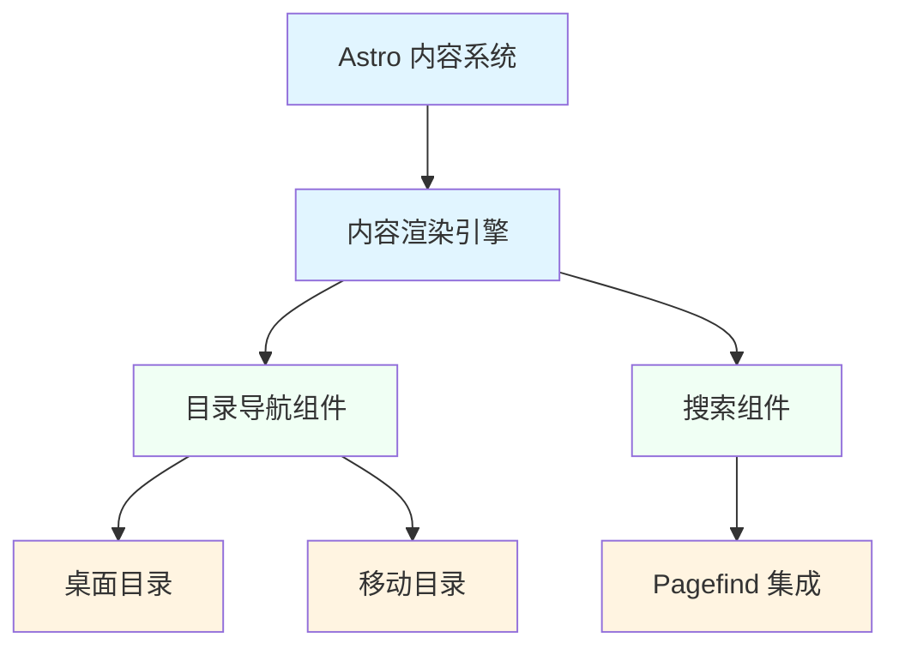

# zeptoclaw 模块文档

## 概述

zeptoclaw 是一个基于 Astro 框架构建的文档站点模块，提供了完整的文档展示和导航功能。该模块旨在为开发者提供优雅的文档阅读体验，包含了目录导航、搜索功能、移动设备优化等核心特性。

### 设计理念

zeptoclaw 模块采用现代化的前端架构设计，注重用户体验和性能优化。模块基于 Astro 静态站点生成器构建，利用其内容集合（Content Collections）功能来组织和管理文档内容，同时通过自定义 Web Components 实现交互式功能。

### 主要功能

- **内容管理**：利用 Astro 的内容集合系统管理文档内容
- **目录导航**：自动生成文档目录并支持滚动高亮
- **搜索功能**：集成 Pagefind 实现全文搜索
- **响应式设计**：为移动设备和桌面设备提供优化的体验
- **Markdown/MDX 支持**：支持渲染 Markdown 和 MDX 格式的文档

## 架构概览

zeptoclaw 模块采用模块化的架构设计，主要包含以下几个核心组件：



### 核心组件说明

1. **Astro 内容系统**：提供内容集合管理、类型安全和渲染功能
2. **内容渲染引擎**：负责将 Markdown/MDX 内容渲染为 HTML
3. **目录导航组件**：提供文档结构导航和当前位置高亮
4. **搜索组件**：集成全文搜索功能，支持快速查找文档内容

## 模块详细说明

### 内容系统

内容系统基于 Astro 的内容集合功能构建，提供类型安全的内容管理。该系统定义了 `Render`、`RenderedContent` 和 `RenderResult` 等核心类型，用于处理文档渲染过程。

主要功能包括：
- 支持 Markdown 和 MDX 格式的文档渲染
- 提供类型安全的内容访问 API
- 支持文档之间的引用关系
- 自动生成文档元数据

更多细节请参考 [内容系统文档](content_system.md)。

### 目录导航组件

目录导航组件由 `TableOfContents` 和 `MobileTableOfContents` 两个 Web Component 组成，分别为桌面和移动设备提供目录导航功能。

主要特性：
- 自动从文档标题生成目录
- 滚动时自动高亮当前章节
- 支持自定义标题层级范围
- 响应式设计，适配不同屏幕尺寸

更多细节请参考 [目录导航组件文档](table_of_contents.md)。

### 搜索组件

搜索组件基于 Pagefind 库实现，提供全文搜索功能。该组件以 Web Component 形式实现，支持模态框展示搜索结果。

主要特性：
- 支持键盘快捷键（Ctrl/Cmd + K）
- 实时搜索结果展示
- 可自定义翻译文本
- 支持搜索结果 URL 处理

更多细节请参考 [搜索组件文档](search_component.md)。

## 模块集成与工作流程

zeptoclaw 模块的各个子模块之间紧密协作，形成完整的文档站点功能。以下是典型的工作流程：

1. **内容准备阶段**：content_system 模块加载并处理 Markdown/MDX 文档，提取元数据和标题信息
2. **页面渲染阶段**：content_system 渲染文档内容，同时将标题信息传递给 table_of_contents 模块
3. **导航初始化**：table_of_contents 组件监听页面滚动，更新当前阅读位置
4. **搜索功能**：search_component 模块在后台初始化，为用户提供全文搜索能力

这种模块化设计使得各个组件可以独立开发和测试，同时通过清晰的接口进行协作。

## 使用指南

### 基本使用

zeptoclaw 模块作为 Astro 项目的一部分使用，需要在 Astro 配置中设置内容集合。

```javascript
// content.config.js
import { defineCollection, z } from 'astro:content';

const docs = defineCollection({
  schema: z.object({
    title: z.string(),
    description: z.string(),
  }),
});

export const collections = { docs };
```

### 组件使用

各组件以自定义元素形式使用，可以直接在 Astro 页面或组件中引入：

```astro
---
import 'zeptoclaw/TableOfContents';
import 'zeptoclaw/Search';
---

<starlight-toc data-min-h="2" data-max-h="3"></starlight-toc>
<site-search></site-search>
```

## 配置选项

### 目录导航配置

- `data-min-h`：最小标题层级（默认：2）
- `data-max-h`：最大标题层级（默认：3）

### 搜索组件配置

- `data-translations`：JSON 格式的翻译文本
- `data-strip-trailing-slash`：是否去除 URL 尾部斜杠

## 注意事项和限制

1. **性能考虑**：目录导航组件使用 IntersectionObserver API，在大量标题的情况下可能会影响性能
2. **浏览器兼容性**：组件使用现代 Web API，需要在支持的浏览器中运行
3. **内容结构**：文档标题需要有正确的层级结构，目录导航才能正常工作
4. **搜索索引**：Pagefind 需要在构建时生成搜索索引，确保在部署前正确构建

## 扩展开发

zeptoclaw 模块设计为可扩展的，开发者可以：

1. 继承现有组件创建自定义版本
2. 通过配置选项调整组件行为
3. 添加新的内容集合类型
4. 自定义搜索结果展示

更多扩展开发指南请参考各子模块文档。
