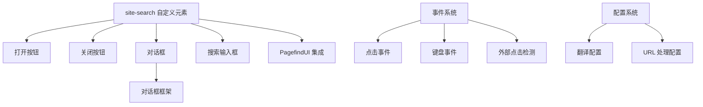
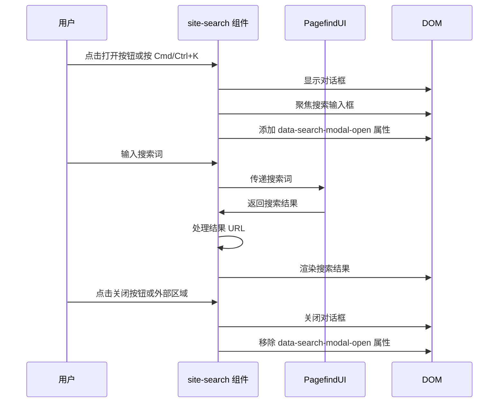

# search_component 模块文档

## 目录
1. [模块概述](#模块概述)
2. [核心组件](#核心组件)
3. [架构设计](#架构设计)
4. [使用指南](#使用指南)
5. [配置选项](#配置选项)
6. [注意事项](#注意事项)
7. [与其他模块的关系](#与其他模块的关系)

---

## 模块概述

search_component 模块是一个功能完善的搜索组件，为文档网站提供全文搜索能力。它集成了 Pagefind 搜索引擎，并提供了现代化的用户界面，包括模态框展示、键盘快捷键支持、以及结果处理功能。

该模块的设计目标是提供一个轻量级、高性能的搜索体验，同时保持良好的可访问性和用户体验。它支持翻译配置、URL 处理、以及搜索结果的自定义渲染。

---

## 核心组件

### S 类 (Search Component)

**文件路径**: `landing/r8r/docs/dist/_astro/Search.astro_astro_type_script_index_0_lang.D1q3JamP.js`

`S` 类是搜索组件的核心实现，它继承自 `HTMLElement`，并作为自定义元素 `site-search` 注册到浏览器中。

#### 主要功能

1. **模态框管理**: 负责搜索模态框的打开、关闭和状态管理
2. **事件处理**: 处理鼠标点击、键盘快捷键等用户交互
3. **搜索引擎集成**: 集成 Pagefind 搜索引擎并初始化搜索界面
4. **翻译支持**: 支持多语言翻译配置
5. **URL 处理**: 处理搜索结果中的 URL，可选择去除末尾斜杠

#### 构造函数详解

构造函数初始化了所有必要的事件监听器和配置：

```javascript
constructor() {
    super();
    // 获取 DOM 元素引用
    const m = this.querySelector("button[data-open-modal]");
    const l = this.querySelector("button[data-close-modal]");
    const c = this.querySelector("dialog");
    const h = this.querySelector(".dialog-frame");
    
    // 定义事件处理函数
    // 初始化事件监听器
    // 配置翻译和 URL 处理
    // 初始化 Pagefind 搜索界面
}
```

#### 关键事件处理

1. **模态框打开 (`o` 函数)**:
   - 显示搜索对话框
   - 在 body 元素上设置 `data-search-modal-open` 属性
   - 自动聚焦到搜索输入框
   - 添加全局点击监听器以处理外部点击关闭

2. **模态框关闭 (`t` 函数)**:
   - 关闭搜索对话框
   - 移除 body 上的 `data-search-modal-open` 属性

3. **键盘快捷键**:
   - 支持 `Cmd/Ctrl + K` 快捷键切换搜索模态框的打开/关闭状态

4. **外部点击检测**:
   - 当用户点击模态框外部时自动关闭搜索框

#### Pagefind 集成

组件在 `DOMContentLoaded` 事件后初始化 Pagefind 搜索界面：

```javascript
window.addEventListener("DOMContentLoaded", () => {
    (window.requestIdleCallback || (i => setTimeout(i, 1)))(async () => {
        const { PagefindUI: i } = await E(async () => {
            const { PagefindUI: s } = await import("./ui-core.D1A0u6ny.js");
            return { PagefindUI: s };
        }, []);
        new i({
            element: "#starlight__search",
            baseUrl: "/",
            bundlePath: "/pagefind/",
            showImages: false,
            translations: u,
            showSubResults: true,
            processResult: s => {
                s.url = r(s.url);
                s.sub_results = s.sub_results.map(p => (p.url = r(p.url), p));
            }
        });
    });
});
```

这段代码使用 `requestIdleCallback`（或回退到 `setTimeout`）在浏览器空闲时初始化搜索界面，确保不阻塞页面的主要渲染。

---

## 架构设计

### 组件结构



### 数据流



### 模块加载架构

组件使用了一个模块化加载系统 `E` 函数，它负责：

1. **预加载资源**: 预加载 JavaScript 和 CSS 文件
2. **错误处理**: 处理加载错误并触发 `vite:preloadError` 事件
3. **CSP 支持**: 尊重内容安全策略，使用 nonce 属性
4. **模块预加载**: 使用 `modulepreload` 链接类型优化加载性能

---

## 使用指南

### 基本使用

要使用搜索组件，只需在 HTML 中添加 `site-search` 自定义元素：

```html
<site-search data-translations='{"search": "搜索", "clear_search": "清除搜索"}'>
    <button data-open-modal>搜索</button>
    <dialog>
        <div class="dialog-frame">
            <button data-close-modal>关闭</button>
            <div id="starlight__search"></div>
        </div>
    </dialog>
</site-search>
```

### 必需的 DOM 结构

组件内部需要以下特定的 DOM 元素：

1. **打开按钮**: 带有 `data-open-modal` 属性的按钮
2. **关闭按钮**: 带有 `data-close-modal` 属性的按钮
3. **对话框**: `<dialog>` 元素
4. **对话框框架**: 带有 `.dialog-frame` 类的元素（用于外部点击检测）
5. **搜索容器**: 带有 `#starlight__search` ID 的元素（PagefindUI 的挂载点）

### 键盘快捷键

- **Cmd/Ctrl + K**: 打开/关闭搜索模态框
- **Escape**: 关闭搜索模态框（浏览器原生支持）

---

## 配置选项

### 数据属性配置

组件支持以下 `data-*` 属性进行配置：

1. **`data-translations`**: JSON 格式的翻译字符串
   ```html
   <site-search data-translations='{"search": "搜索", "no_results": "无结果"}'>
   ```

2. **`data-strip-trailing-slash`**: 去除搜索结果 URL 末尾的斜杠
   ```html
   <site-search data-strip-trailing-slash>
   ```

### PagefindUI 配置

组件内部初始化 PagefindUI 时使用了以下配置：

| 配置项 | 值 | 说明 |
|--------|-----|------|
| `element` | `"#starlight__search"` | PagefindUI 挂载的元素 |
| `baseUrl` | `"/"` | 基础 URL |
| `bundlePath` | `"/pagefind/"` | Pagefind 资源路径 |
| `showImages` | `false` | 不显示搜索结果中的图片 |
| `translations` | 从 `data-translations` 获取 | 翻译配置 |
| `showSubResults` | `true` | 显示子结果 |
| `processResult` | URL 处理函数 | 自定义搜索结果处理 |

### 翻译支持

支持的翻译键包括（但不限于）：

- `search`: 搜索按钮文本
- `clear_search`: 清除搜索按钮文本
- `no_results`: 无结果时的提示文本
- `search_label`: 搜索输入框的标签
- `load_more`: 加载更多结果的文本
- 其他 PagefindUI 支持的翻译键

---

## 注意事项

### 边缘情况

1. **元素缺失**: 如果组件内部缺少必需的 DOM 元素，相关功能将无法正常工作，但不会抛出错误
2. **翻译解析失败**: 如果 `data-translations` 不是有效的 JSON，组件将使用空对象作为翻译配置
3. **Pagefind 加载失败**: 如果 PagefindUI 加载失败，组件将通过 `vite:preloadError` 事件通知
4. **URL 处理**: `data-strip-trailing-slash` 只会去除路径末尾的斜杠，不会影响锚点或查询参数

### 性能考虑

1. **延迟初始化**: 组件使用 `requestIdleCallback` 延迟初始化 PagefindUI，避免阻塞页面渲染
2. **资源预加载**: 使用 `modulepreload` 优化资源加载性能
3. **事件清理**: 模态框关闭时会正确移除事件监听器，避免内存泄漏

### 可访问性

1. **模态框焦点管理**: 打开模态框时会自动聚焦到搜索输入框
2. **键盘导航**: 完整支持键盘操作，包括快捷键和 Tab 键导航
3. **语义化 HTML**: 使用 `<dialog>` 元素提供原生的模态框行为

---

## 与其他模块的关系

search_component 模块是一个相对独立的组件，但它与网站的其他部分有以下关系：

1. **content_system 模块**: 搜索组件索引的内容来自 content_system 模块处理和渲染的文档
2. **table_of_contents 模块**: 搜索结果可能会链接到文档的特定部分，与目录导航功能互补

详细信息请参考相关模块的文档：
- [content_system 模块文档](content_system.md)
- [table_of_contents 模块文档](table_of_contents.md)
