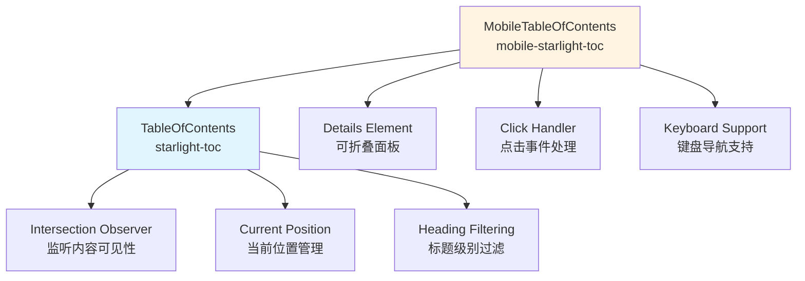

# 目录 (Table of Contents) 模块文档

## 1. 概述

目录模块是文档系统的核心导航组件，提供页面内容结构的可视化表示和快速导航功能。该模块包含两个主要组件：标准目录组件（TableOfContents）和移动端目录组件（MobileTableOfContents），它们协同工作以在不同设备上提供一致的用户体验。

### 1.1 核心功能

- **自动内容扫描**：自动检测页面中的标题元素并构建导航结构
- **当前位置高亮**：通过 Intersection Observer API 实时跟踪用户阅读位置
- **响应式设计**：同时支持桌面端和移动端的不同交互模式
- **平滑滚动导航**：点击目录项可快速跳转到对应内容区域
- **智能边界计算**：考虑页面头部和其他固定元素对可见区域的影响

### 1.2 设计理念

目录模块采用了 Web Components 技术实现，通过自定义元素封装所有功能，确保了组件的独立性和可重用性。这种设计允许目录组件在不同的页面和框架中无缝使用，同时保持一致的行为和外观。

## 2. 组件架构



### 2.1 组件关系

目录模块采用继承模式，`MobileTableOfContents` 组件继承自 `TableOfContents` 组件，扩展了移动端特有的交互功能。这种设计确保了两个组件在核心功能上保持一致，同时针对不同设备场景提供优化的用户体验。

## 3. 核心组件详解

### 3.1 TableOfContents 组件 (f)

#### 3.1.1 组件定义

TableOfContents 组件是一个自定义 Web Component，注册为 `starlight-toc` 元素。它负责监控页面滚动位置，自动高亮当前阅读区域对应的目录项。

#### 3.1.2 构造函数与初始化

```javascript
constructor() {
    super();
    this._current = this.querySelector('a[aria-current="true"]');
    this.minH = parseInt(this.dataset.minH || "2", 10);
    this.maxH = parseInt(this.dataset.maxH || "3", 10);
    // ... 初始化逻辑
}
```

**参数配置：**
- `data-min-h`：最小标题级别（默认为 2，即 h2）
- `data-max-h`：最大标题级别（默认为 3，即 h3）
- `aria-current="true"`：初始当前位置的标记

#### 3.1.3 核心方法

##### `init()` 方法

初始化目录组件的核心功能：
- 收集所有目录链接
- 设置 Intersection Observer 监听页面元素
- 配置事件监听器

##### `getRootMargin()` 方法

计算 Intersection Observer 的根边距，考虑页面头部和目录摘要的高度，确保正确的可见区域判断：

```javascript
getRootMargin() {
    const headerHeight = document.querySelector("header")?.getBoundingClientRect().height || 0;
    const summaryHeight = this.querySelector("summary")?.getBoundingClientRect().height || 0;
    const topMargin = headerHeight + summaryHeight + 32;
    const bottomMargin = topMargin + 53;
    const viewportHeight = document.documentElement.clientHeight;
    return `-${topMargin}px 0% ${bottomMargin - viewportHeight}px`;
}
```

##### `current` 属性 setter

管理当前活动目录项的视觉状态，通过 `aria-current` 属性提供无障碍支持：

```javascript
set current(element) {
    if (element !== this._current) {
        this._current && this._current.removeAttribute("aria-current");
        element.setAttribute("aria-current", "true");
        this._current = element;
    }
}
```

#### 3.1.4 工作原理

1. **标题过滤**：组件会遍历页面内容，只选择配置范围内的标题元素（默认为 h2 和 h3）
2. **可见性监听**：使用 Intersection Observer API 监控页面元素的可见状态
3. **当前位置计算**：当元素进入视口时，查找最近的祖先标题元素
4. **状态更新**：更新目录中对应链接的高亮状态
5. **响应式处理**：在窗口大小变化时重新计算并初始化观察器

### 3.2 MobileTableOfContents 组件 (c)

#### 3.2.1 组件定义

MobileTableOfContents 组件继承自 TableOfContents，注册为 `mobile-starlight-toc` 元素，专门为移动设备优化交互体验。

#### 3.2.2 扩展功能

##### 重写 `current` 属性 setter

在继承基础上增加了显示当前标题文本的功能：

```javascript
set current(element) {
    super.current = element;
    const displayElement = this.querySelector(".display-current");
    displayElement && (displayElement.textContent = element.textContent);
}
```

##### 移动端交互处理

- **点击链接关闭面板**：点击目录项后自动关闭可折叠面板
- **外部点击关闭**：点击面板外部区域关闭目录
- **Escape 键支持**：按 Escape 键关闭面板并恢复焦点

## 4. 使用指南

### 4.1 基本使用

#### 桌面端目录

```html
<starlight-toc data-min-h="2" data-max-h="3">
    <nav>
        <ul>
            <li><a href="#section-1">第一节</a></li>
            <li><a href="#section-2">第二节</a>
                <ul>
                    <li><a href="#subsection-2-1">小节 2.1</a></li>
                </ul>
            </li>
        </ul>
    </nav>
</starlight-toc>
```

#### 移动端目录

```html
<mobile-starlight-toc data-min-h="2" data-max-h="3">
    <details>
        <summary>
            <span class="display-current">目录</span>
        </summary>
        <nav>
            <!-- 目录内容 -->
        </nav>
    </details>
</mobile-starlight-toc>
```

### 4.2 配置选项

| 属性 | 类型 | 默认值 | 描述 |
|------|------|--------|------|
| `data-min-h` | 数字 | 2 | 包含在目录中的最小标题级别 |
| `data-max-h` | 数字 | 3 | 包含在目录中的最大标题级别 |
| `aria-current` | 字符串 | - | 标记当前活动的目录项 |

### 4.3 与内容系统的集成

目录组件需要与内容系统（content_system）配合使用，内容系统负责渲染页面内容并为标题元素分配唯一 ID。目录组件会自动扫描这些带 ID 的标题元素来构建导航结构。

详细信息请参考 [content_system 模块文档](content_system.md)。

## 5. 高级功能

### 5.1 性能优化

目录组件实现了多项性能优化：

1. **延迟初始化**：使用 `requestIdleCallback`（或降级为 `setTimeout`）确保初始化不阻塞页面渲染
2. **事件节流**：窗口大小变化事件使用防抖处理，避免频繁重新计算
3. **观察器管理**：在不需要时及时清理 Intersection Observer，防止内存泄漏

### 5.2 无障碍支持

组件内置了完善的无障碍支持：

- 使用 `aria-current` 属性标识当前位置
- 移动端组件支持键盘导航
- 合理的焦点管理，确保键盘用户体验流畅

## 6. 注意事项与边界情况

### 6.1 已知限制

1. **标题 ID 要求**：目录功能依赖于标题元素具有唯一的 `id` 属性，无 ID 的标题不会被追踪
2. **固定内容影响**：页面上的固定定位元素可能会影响 Intersection Observer 的计算精度
3. **动态内容**：如果页面内容在初始加载后发生变化，目录组件不会自动更新，需要手动重新初始化

### 6.2 错误处理

组件具有基本的容错机制：

- 如果未找到目录链接或标题元素，组件会安静失败而不会抛出错误
- `getRootMargin()` 方法在找不到 header 或 summary 元素时会使用默认值 0

### 6.3 最佳实践

1. **标题层级**：确保页面标题使用正确的层级结构，不要跳过级别
2. **唯一 ID**：确保每个标题元素都有唯一且稳定的 ID
3. **合理配置**：根据页面内容长度调整 `data-min-h` 和 `data-max-h`，避免目录过长或过短
4. **CSS 样式**：为 `aria-current="true"` 的链接提供明显的视觉样式，增强用户体验

## 7. 扩展开发

### 7.1 创建自定义目录组件

开发者可以继承 TableOfContents 组件创建自定义目录组件：

```javascript
import { S as TableOfContents } from './TableOfContents.js';

class CustomTableOfContents extends TableOfContents {
    constructor() {
        super();
        // 自定义初始化逻辑
    }
    
    // 重写或添加方法
    set current(element) {
        super.current = element;
        // 添加自定义行为
    }
}

customElements.define('custom-toc', CustomTableOfContents);
```

## 8. 相关模块

- [内容系统 (content_system)](content_system.md)：负责渲染文档内容，是目录组件的数据源
- [搜索组件 (search_component)](search_component.md)：提供文档搜索功能，与目录组件共同构成导航系统

---

*文档版本：1.0.0 | 最后更新：2024年*
